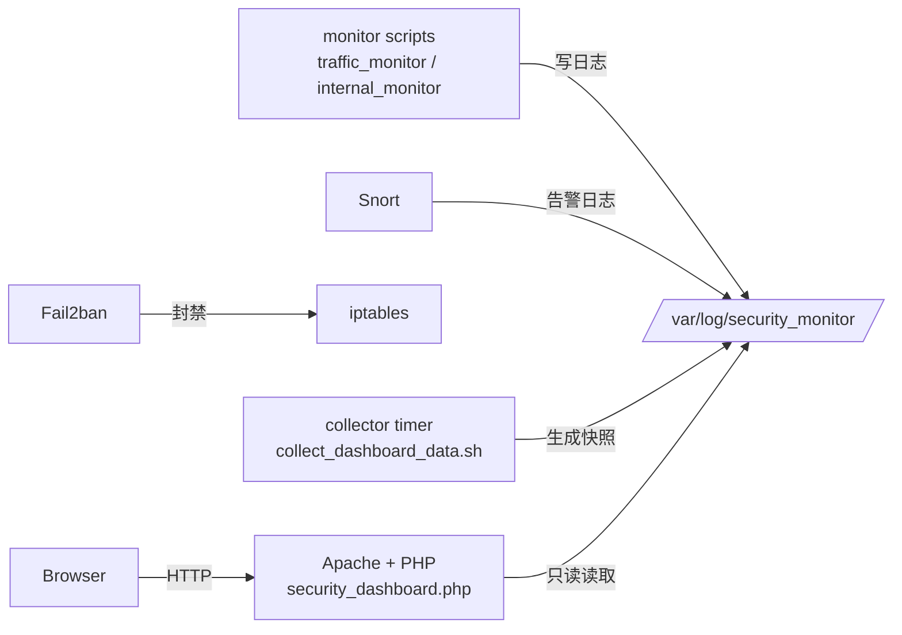

# 基于 Kali 的轻量级 Web 安全监控系统

> 课程设计项目：在 **Kali Linux** 上集成 **防火墙（iptables）**、**入侵检测（Snort）**、**主机/内网异常检测（脚本）** 与 **Fail2ban**，并提供一个 Web 监控面板用于集中展示。

## 功能概览

- **Web 监控面板**：只读展示系统状态、网络连接、iptables 摘要、Snort 告警、系统日志等（每 5 秒刷新）
- **网络流量监控**：按固定间隔采样网卡计数器与连接状态，记录到日志，并给出简单阈值告警
- **内网/主机异常监控**：端口扫描、ARP 欺骗、ICMP flood、异常连接数、可疑端口、DNS 隧道（启发式）等
- **Snort 自定义规则**：SQL 注入 / XSS / 扫描 / DDoS / 数据泄露等样例规则
- **Fail2ban**：对 SSH / Apache 相关日志进行封禁（基础示例配置）


## 系统架构（简化）



## 快速开始

> 推荐先在 **虚拟机/实验环境** 测试。

```bash
git clone <your_repo_url>
cd security-monitor
sudo ./scripts/install.sh
```

安装完成后访问：

- `http://<你的IP>/security_dashboard.php`

### （可选）启用防火墙规则

⚠️ **高风险**：会重置 iptables 并默认 `DROP`，远程服务器可能把自己锁在外面。

```bash
sudo ./scripts/install.sh --with-firewall
```

## 目录结构

```
security-monitor/
  web/                       # PHP 面板（只读）
  scripts/                   # 监控脚本、安装脚本、采集脚本
  snort/                     # Snort 自定义规则
  systemd/                   # systemd service / timer 单元文件
  config/                    # 默认配置（安装后复制到 /etc/security_monitor）
  docs/                      # 文档与论文
```

## 运行与管理

### systemd 服务

- `traffic-monitor`：网络流量监控（daemon 模式写日志）
- `internal-monitor`：内网/主机异常监控（daemon 模式周期检查）
- `security-monitor-collector.timer`：每 5 秒采集一次面板快照（供 PHP 读取）

常用命令：

```bash
systemctl status traffic-monitor
systemctl status internal-monitor
systemctl status security-monitor-collector.timer

# 查看日志
tail -f /var/log/security_monitor/traffic_monitor.log
tail -f /var/log/security_monitor/internal_monitor.log
```

### 手动运行

```bash
# 终端实时看板
sudo /usr/local/bin/traffic_monitor.sh realtime
sudo /usr/local/bin/internal_monitor.sh realtime

# 单次检查
sudo /usr/local/bin/internal_monitor.sh scan
```

## 配置

默认配置文件：

- 安装后：`/etc/security_monitor/security_monitor.conf`

可调整：采样间隔、阈值、日志目录等。

## 安全说明

- 面板 `security_dashboard.php` **不执行系统命令**，只读取 `collector` 写入的快照文件，避免 `shell_exec + sudo` 的风险。
- `--with-firewall` 仅提供非常基础的示例规则，真实环境请根据业务端口、SSH 端口、白名单等做加固。
- 规则/阈值均为示例性质，可能存在误报/漏报。

## 自检

```bash
sudo ./scripts/self_test.sh
```

## 卸载

```bash
sudo /usr/local/bin/security_monitor_uninstall.sh
```


